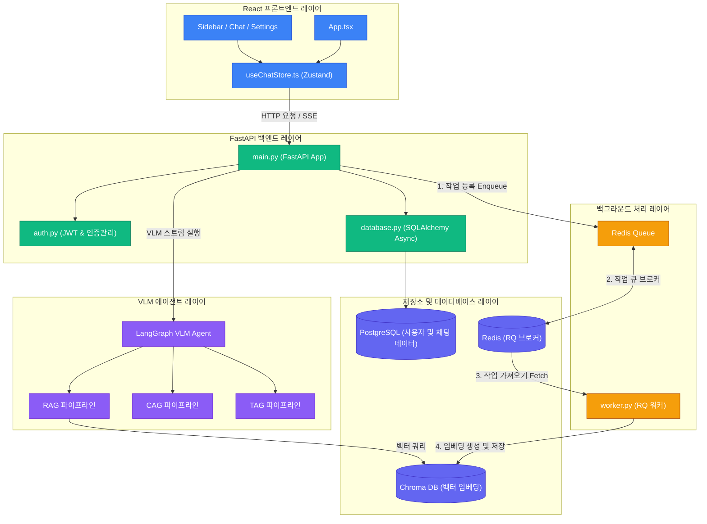
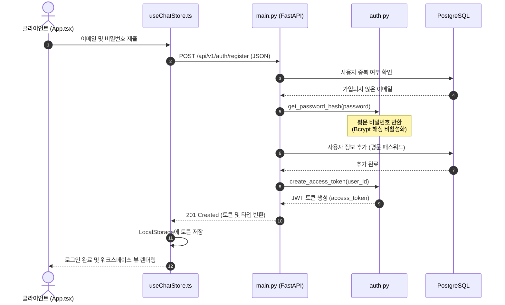
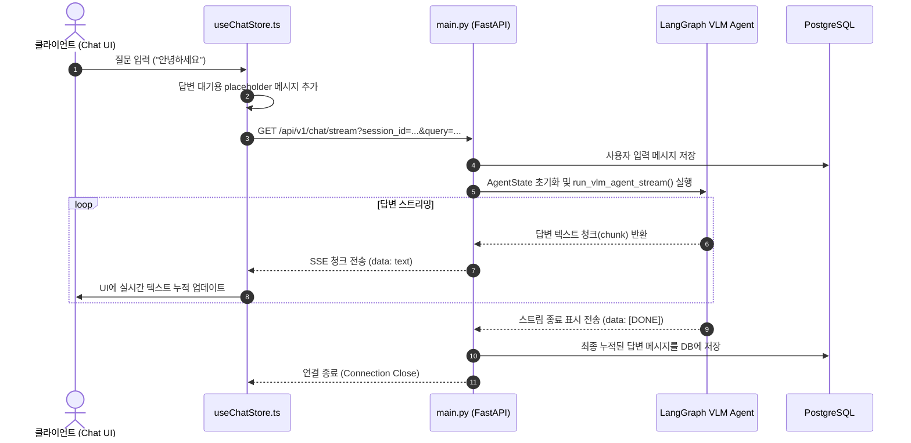
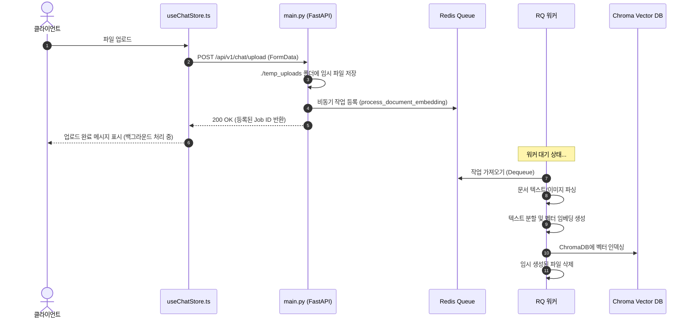

# 프로젝트 아키텍처 개요

이 문서는 VLM (Vision-Language Model) 프로젝트의 시스템 아키텍처와 주요 데이터 흐름을 설명합니다. 본 시스템은 Vite 기반의 React 프론트엔드, FastAPI 백엔드, Redis Queue를 활용한 비동기 백그라운드 워커, 그리고 LangGraph 기반의 VLM 에이전트 파이프라인으로 구성되어 있습니다.

---

## 1. 하이레벨 시스템 아키텍처

아래 다이어그램은 각 레이어 간의 컴포넌트가 어떻게 상호작용하는지 보여줍니다.

---

## 2. 주요 데이터 흐름

### A. 사용자 인증 흐름 (회원가입 및 로그인)
사용자 인증은 JWT 토큰 방식으로 처리됩니다. 비밀번호 암호화 로직은 로컬 및 배포 환경의 호환성 이슈 해결을 위해 임시로 평문(Plaintext) 비교 및 저장 방식으로 수정되었습니다.

---

### B. 채팅 SSE (Server-Sent Events) 스트리밍 흐름
VLM(Vision-Language Model)의 실시간 답변 출력을 위해 시스템은 LangGraph와 SSE 스트림을 구현하여 실시간 통신을 수행합니다.

---

### C. 파일 업로드 및 비동기 문서 임베딩 흐름
RAG(검색 증강 생성) 처리를 위해 업로드된 대용량 파일이나 문서는 메인 스레드를 블로킹하지 않도록 Redis Queue를 사용하여 비동기로 처리됩니다.

---

## 3. 기술 스택 및 컴포넌트 디렉토리

### 프론트엔드 (Frontend)
- **프레임워크**: React 18, TypeScript, Vite
- **스타일링**: Tailwind CSS
- **상태 관리**: Zustand
- **디렉토리**: `frontend/`
  - `src/App.tsx`: 인증 화면(로그인/회원가입) 및 메인 레이아웃 뷰 렌더링.
  - `src/store/useChatStore.ts`: 상태 저장 및 API 요청 처리.
  - `src/components/`: 레이아웃 서브 컴포넌트(Chat panel, Settings modal, Sidebar).

### 백엔드 (Backend)
- **프레임워크**: FastAPI (Python >= 3.11)
- **데이터베이스 ORM**: SQLAlchemy (Async)
- **작업 큐**: RQ (Redis Queue)
- **에이전트 오케스트레이션**: LangGraph & LangChain
- **디렉토리**: `backend/`
  - `app/main.py`: REST API 엔드포인트 및 SSE 컨트롤러 정의.
  - `app/auth.py`: JWT 토큰 발급 및 평문 패스워드 인증 로직 구현.
  - `app/database.py`: SQLAlchemy 기반 DB 세션 관리 및 모델(User, ChatSession, ChatMessage) 정의.
  - `app/worker.py`: 비동기 문서 파싱 및 벡터 임베딩 등록 백그라운드 워커.
  - `app/agent/`: LangGraph 기반의 AI VLM 에이전트 인텔리전트 파이프라인.
